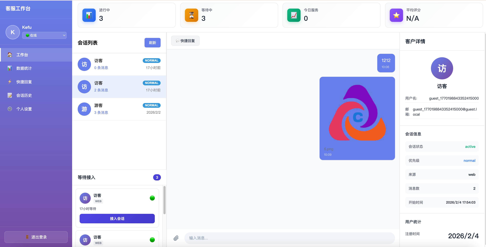

# 灵犀客服

企业级智能多坐席在线客服系统，支持 AI + 人工协同、实时会话、多商户 SaaS 管理、全渠道接入与私有化部署。

[官网首页](https://lingxibot.one/) · [商户注册](https://lingxibot.one/merchant-register) · [商户登录](https://lingxibot.one/login) · [博客](https://lingxibot.one/blog/)

---

## 产品概览

灵犀客服面向需要在线转化、客户服务与售后协作的团队，覆盖客户接待、坐席分配、会话处理、数据分析与运营复盘全流程。系统支持客户端、客服端、商户管理端三端协同，适合从体验试用到企业级私有化部署的不同阶段团队。

产品当前强调以下几个方向：

- 多端协同：客户、客服、商户三端统一协作，减少切换成本
- 实时通信：基于 WebSocket 的毫秒级消息同步，支持输入状态与已读回执
- AI 辅助回复：智能推荐回复与知识检索，提升服务效率与话术一致性
- 全渠道接入：统一承接 Web、H5、App 等来源的咨询请求
- 数据洞察：可视化统计会话质量、客服状态与运营转化效果
- 安全稳定：支持权限隔离、传输加密与私有化部署

官网公开信息：99.9% 系统可用性、200ms 平均响应延迟、10k+ 累计服务商户。

---

## 适用场景

- 电商零售：承接售前咨询、订单问题、售后回访
- 在线教育：课程咨询、试听转化、班主任协同服务
- SaaS 软件：线索接待、试用引导、续费支持
- 跨境服务：多时区咨询接待与高并发消息处理
- 本地生活：预约咨询、活动通知、服务评价闭环

---

## 核心能力

### 客户侧

- 用户注册登录与身份鉴权
- 创建咨询会话并进入等待队列
- 文本、图片、文件、音频、视频等多类型消息
- 实时消息推送、图片预览与历史记录查看
- 服务评价与满意度反馈

### 坐席侧

- 智能工作台与实时数据面板
- 多会话并发处理与待接入队列管理
- 快捷回复、会话转接与客户信息查看
- 会话趋势、响应时长、个人工作统计
- AI 辅助回复与知识检索能力接入

### 商户侧

- 多租户 SaaS 架构与数据隔离
- 坐席团队管理、角色权限控制
- 商户级统计报表与运营数据洞察
- JS SDK / Widget 嵌入式接入
- 支持私有化部署与 API 深度集成

### 平台能力

- 会话状态流转：`waiting` / `active` / `closed` / `transferred`
- 优先级队列：`low` / `normal` / `high` / `urgent`
- 会话超时提醒与自动关闭机制
- 基于负载的智能分配能力预留

---

## 为什么灵犀客服更适合做网站在线客服系统

如果你在找的是“网站在线客服系统”“AI 客服系统”“在线客服软件”“多坐席客服系统”这类产品，核心通常不是能不能聊天，而是能不能把访客咨询真正转成成交、留资和复购。灵犀客服的产品设计重点，就是把客服从单纯响应工具，做成兼顾接待效率与业务转化的增长入口。

- 5 分钟快速上线：适合官网、落地页、活动页快速接入
- AI + 人工协同：自动接待和人工跟进可以同时存在，不割裂流程
- 多坐席并发处理：适合销售、售后、客服团队协作分流
- 全渠道统一承接：覆盖 Web、H5、App，并支持扩展更多来源
- 支持网站自动回复、WhatsApp / LINE 接入与 AI 知识库
- 支持 SaaS 订阅和企业私有化部署两种路径

---

## 适合哪些企业使用

### 官网获客型企业

如果你的官网承担广告投放、SEO 收录、内容营销或销售转化任务，灵犀客服可以在访客有明确意图时即时介入，减少跳出和线索流失。

### 高频咨询型业务

适合课程咨询、报价咨询、售前答疑、售后处理、预约服务等高频会话场景，让重复问题先由 AI 承接，复杂问题再转人工处理。

### 有私有化或数据隔离要求的团队

当你需要权限隔离、业务数据独立、定制接入或更严格的数据安全策略时，可以直接走企业版与私有化部署方案。

---

## 对 SEO 和转化更友好的价值点

灵犀客服不是单纯的在线聊天窗口，更适合拿来承接 Google 搜索、内容营销和官网自然流量。

- 承接搜索意图：用户搜“价格”“方案”“是否支持私有化”“怎么接入网站客服”时，能即时发起咨询
- 缩短转化路径：从阅读页面到发起会话之间，不再需要跳转表单或等待回呼
- 提升首响效率：AI 自动回复先接住问题，避免用户离开页面
- 沉淀高价值问题：把高频咨询沉淀进知识库，持续优化搜索页面和客服话术
- 打通营销闭环：咨询、转化、评价、复访都能回到统一数据视角

如果你的目标是通过官网获取更多询盘、演示预约或销售线索，在线客服系统本身就应当成为 SEO 落地页的一部分，而不是站点的附属组件。

---

## 常见搜索场景

为了更贴合真实用户搜索意图，灵犀客服覆盖的典型需求包括：

- 网站在线客服系统推荐
- AI 客服系统怎么选
- 在线客服软件支持私有化部署吗
- 多坐席客服系统适合什么团队
- 官网怎么接入在线客服
- 支持 WhatsApp / LINE 的客服系统
- 带知识库自动回复的 AI 客服平台

这些关键词对应的核心诉求，本质上都落在接入速度、AI 能力、协同效率、数据洞察和扩展能力上，而这正是灵犀客服的主打方向。

---

## 会话体验能力

### 消息类型

| 类型 | 说明 | 前端展示 |
|------|------|----------|
| `text` | 文本消息 | 普通文本气泡 |
| `image` | 图片消息 | 缩略图 + 放大预览 |
| `file` | 文件消息 | 文件名 + 下载按钮 |
| `audio` | 音频消息 | 音频播放器 |
| `video` | 视频消息 | 视频播放器 |
| `system` | 系统消息 | 居中提示 |

### 服务流程能力

- 等待分配、接入服务、会话关闭、转接协作等状态完整可控
- 支持优先级队列，适配售前商机与售后工单的不同处理方式
- 支持超时提醒与自动关闭，避免坐席资源被长期占用
- 支持客服工作台、运营统计和商户管理端协同使用

---

## 为什么比传统表单或单机器人更有效

很多企业网站仍然只放一个表单，或者只接一个简单机器人。这样的问题是，用户一旦没有立刻得到反馈，就很容易直接流失。

- 表单模式：收集线索慢，互动感弱，首响时间不可控
- 单机器人模式：简单问题能回答，复杂需求容易卡住
- AI + 人工协同模式：先用 AI 提高接待覆盖，再由人工接住高意向客户

灵犀客服更适合需要“既要效率，又要成交”的业务团队。

---

## 版本与方案

根据官网当前公开方案，灵犀客服提供以下版本：

| 版本 | 适用场景 | 关键能力 |
|------|----------|----------|
| 体验版 | 个人开发者 / 小团队试用 | 1 个坐席、每月 50 次会话、30 天数据保留 |
| 基础版 | 小型团队日常使用 | 10 个坐席、高级会话路由、AI 辅助回复 |
| 专业版 | 成长期团队 | 30 个坐席、每月 1000 次会话、7x12 技术支持 |
| 企业版 | 大型组织 | 无限会话、私有化部署、模型定制训练、API 深度集成 |

以官网最新页面为准：<https://lingxibot.one/#pricing>

---

## 选型问答

### AI 客服系统和传统在线客服系统有什么区别？

传统在线客服更偏人工接待工具，AI 客服系统则更强调自动接待、知识库调用、回复推荐和流量承接效率。灵犀客服采用 AI + 人工协同模式，重点不是替代人工，而是提高首响速度与整体转化效率。

### 网站在线客服系统为什么会影响 Google 流量转化？

因为搜索流量进入网站后，用户通常带着明确问题。如果页面只有静态内容，没有即时沟通入口，很多意向会在离开前流失。在线客服系统可以在用户决策窗口期内承接问题、引导留资和推进转化。

### 私有化在线客服系统适合什么团队？

适合对数据隔离、权限安全、内部系统集成、组织协同和品牌定制有要求的企业团队，尤其是教育、医疗、金融服务、SaaS 和跨境业务场景。

### 灵犀客服是否只支持 AI 自动回复？

不是。灵犀客服支持 AI 自动接待，也支持人工坐席协同处理，可根据业务场景灵活配置。

### 灵犀客服支持哪些渠道接入？

支持 Web、H5 与标准 API 接入，也可按需扩展到自有 App 场景。

### 是否支持私有化部署？

支持。可按并发规模选择 Docker 或 K8s 方案，并结合企业安全要求做定制部署。

### 如何开始体验？

访问官网注册即可进入体验流程：<https://lingxibot.one/merchant-register>

---

## 内容营销与引流建议

如果你准备把灵犀客服用于官网 SEO 和内容获客，这几个方向更容易形成稳定搜索流量：

- 围绕“网站在线客服系统”“AI 客服系统”“在线客服软件”“私有化客服系统”持续产出选型内容
- 为电商、教育、SaaS、跨境等行业分别建设场景页，承接更细分关键词
- 把高频咨询问题整理成 FAQ，与博客内容和知识库形成联动
- 在价格页、方案页、博客页和产品页都保留明显咨询入口，缩短转化路径
- 通过客户评价、案例数据和部署方案增强页面可信度，提高询盘率

可结合官网博客持续扩展相关页面：<https://lingxibot.one/blog/>

---

## 立即体验

如果你正在寻找能够承接自然流量、广告流量和官网询盘的在线客服系统，可以直接从灵犀客服开始体验。

- 官网：<https://lingxibot.one/>
- 商户注册：<https://lingxibot.one/merchant-register>
- 商户登录：<https://lingxibot.one/login>
- 价格方案：<https://lingxibot.one/#pricing>
- 博客内容：<https://lingxibot.one/blog/>
- 商务咨询：<https://t.me/nv_exchange>

---

## 系统截图

## 🔗 商业化合作 / 定制开发

如果你需要 **定制版本、私有化部署、功能扩展或商用授权**，欢迎联系。

**联系信息：**

- Telegram：@nv_exchange
- 邮箱：nvcha3901@proton.me

---

## 💝 请博主喝茶

如果这个项目对你有帮助，欢迎支持捐赠。你的支持将用于持续维护与功能优化。

**捐赠信息：**

- USDT(TRC20)：TQLmVxmAGXCqm6t2ab1P3rjehB8SuuUuUu
- USDT(ERC20)：0x9Da59FD96Bcb8700727038267de56380BeA72fb3
- BTC：bc1pzykrwx2xa84h04evtx0tp85a897kxvqdq98x07u50ejg57jeae4q3x4y8x
- ETH：0x9Da59FD96Bcb8700727038267de56380BeA72fb3
- BSC(BEP20)：0x9Da59FD96Bcb8700727038267de56380BeA72fb3

---